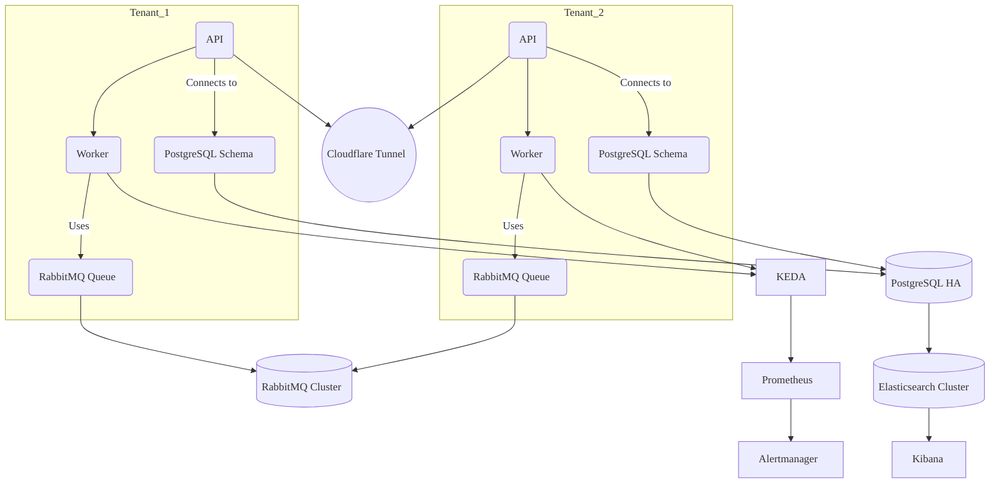

# 🧱 Cluster Architecture

This document provides a high-level overview of how the Salonmaster platform is deployed and structured inside a Kubernetes cluster.

---

## ☁️ Hosting Environment

Salonmaster is designed to run exclusively on **Amazon Web Services (AWS)**. The reference (and preferred) setup assumes:

- A production-grade Kubernetes cluster, typically provisioned via Amazon EKS (Elastic Kubernetes Service)
- Linux nodes (x86 or ARM)
- GitOps-based deployment via **Rancher Fleet**
- High Availability (HA) as the **default** mode

> All system components are deployed with redundancy. Salonmaster does not support single-node deployments.

---

## 🧹 Core Infrastructure Components

| Component                     | Purpose                                        |
| ----------------------------- | ---------------------------------------------- |
| **Kubernetes**                | Orchestrates all workloads and tenant apps     |
| **Rancher Fleet**             | GitOps controller for automated deployments    |
| **Helm Charts**               | Define infrastructure and per-tenant workloads |
| **Persistent Volumes (PVCs)** | For stateful services like DB and queues       |

---

## 📦 Workload Layout

- **Core system components** are deployed into a dedicated `core` or `platform` namespace:

  - RabbitMQ (HA cluster)
  - PostgreSQL (Aurora/Patroni)
  - Elasticsearch (multi-node)
  - Keycloak (multi-replica)
  - Prometheus / Alertmanager

- **Each tenant** gets its own namespace:

  - API Deployment (multi-replica)
  - Worker Deployment (Dramatiq)
  - KEDA ScaledObjects
  - Tenant-specific RabbitMQ queues
  - PostgreSQL schema (schema-per-tenant model)

---

## 🛋️ Ingress & Networking

Salonmaster uses a layered networking model that balances tenant isolation, security, and resilience.

### Public Access

- All externally accessible services are routed exclusively via **Cloudflare Tunnel**.
- Each tenant is served under a unique subdomain:
  - `tenant1.salonhub.io`, `tenant2.salonhub.io`, etc.
- TLS termination is handled at the ingress layer using automated certificate provisioning.

### Internal Service Mesh

- Services communicate internally using **Kubernetes DNS** naming conventions:
  - Example: `postgres.core.svc.cluster.local`
- Each tenant operates in a **separate namespace** with scoped network policies (optional) to restrict cross-tenant access.
- Ingress routes requests to the correct tenant namespace based on hostname.

### DNS and Service Discovery

- Kubernetes handles **service discovery** using built-in DNS
- Tenant-specific APIs are reachable only through the ingress and never exposed directly by NodePorts

### Optional Enhancements

- NetworkPolicies can be applied to **restrict lateral movement**

> Salonmaster ensures multi-tenant traffic isolation while maintaining global visibility and routing efficiency.

---

## 🔐 Secrets & Configuration

- Secrets (e.g., DB credentials, JWT signing keys) are managed via:
  - Kubernetes `Secret` objects
  - Optional: **AWS Secrets Manager** using External Secrets Operator
- Configuration is managed via Helm values per tenant and per environment
- Pods receive config via environment variables at runtime

---

## 📊 Resource Management

- **KEDA** automatically scales API and worker pods based on:
  - RabbitMQ queue depth
  - CPU and memory usage
- **Goldilocks + VPA** provide smart resource tuning recommendations
- All pods are stateless and disposable by design

---

## 🧠 High Availability by Default

Salonmaster is designed to **always run in high availability (HA) mode**.

### HA Strategies

- 📢 **PostgreSQL**: Aurora or Patroni with automatic failover and replication
- 🧵 **RabbitMQ**: Clustered deployment with mirrored queues
- 📊 **Elasticsearch**: Multi-node setup with shard replication
- ♻️ **Stateless Apps**: API and workers run multiple replicas across nodes
- 🌐 **Ingress**: Cloudflare Tunnel with load balancing
- 🔄 **KEDA**: Handles dynamic scaling across nodes with zero-downtime updates

> Salonmaster has no single point of failure and is built to survive node loss, restarts, and rescheduling.

---

## 🔮 Architecture Diagram

---

## 📂 Related Docs

- [Tenant Setup](../tenants/setup.md)
- [Security Model](../architecture/security.md)
- [GitOps via Fleet](../cicd/fleet.md)
- [Observability](../monitoring/grafana.md)

