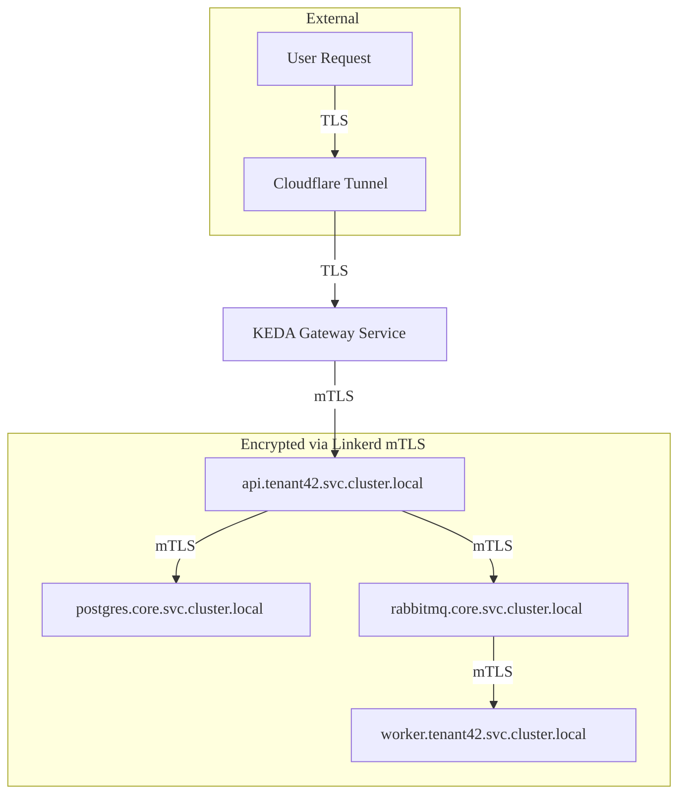

# 🌐 Networking Overview

This document describes the networking model used in Salonmaster, including ingress routing, DNS-based service discovery, and internal communication practices within the Kubernetes cluster.

---

## 📥 Ingress and Public Access

Salonmaster exposes all APIs and public endpoints exclusively through **Cloudflare Tunnel**, which handles:

- Terminating TLS connections
- Basic hostname-based routing (e.g. `grafana.salonhub.io`)

Traffic to tenant APIs is routed through a **KEDA gateway service**, which:

- Wakes up the appropriate tenant deployment on-demand (scale-to-zero)
- Forwards the request to the correct tenant API service once it's active

There are no exposed NodePorts or public LoadBalancers. All public access is funneled through Cloudflare for protection and observability.

> Each tenant has its own subdomain, which maps directly to its namespace and application entry point.

---

## 🛰 Internal Service Communication

Inside the Kubernetes cluster, services communicate using standard **Kubernetes DNS-based discovery**. Example:

```
postgres.core.svc.cluster.local
api.tenant42.svc.cluster.local
```

Internal communication is encrypted using **Linkerd** service mesh and scoped by Kubernetes namespaces.

- Tenant workloads (APIs, workers) run in isolated namespaces
- Shared infrastructure (PostgreSQL, RabbitMQ, etc.) runs in a `core` namespace

> Services are stateless and do not persist connection state or identity beyond what’s provided by the ingress layer.

---

## 🔒 Isolation and Network Policies

Each tenant namespace can optionally define **Kubernetes NetworkPolicies** to:

- Prevent cross-tenant pod-to-pod communication
- Restrict outgoing egress traffic from worker pods

Isolation is primarily enforced at the namespace level. No service is reachable outside of its scope unless explicitly permitted.

---

## 🧭 DNS and Service Discovery

Salonmaster relies on Kubernetes’ internal DNS (CoreDNS) to resolve services. This enables clean separation and discovery:

- `api.tenant1.svc.cluster.local` → tenant 1’s API
- `postgres.core.svc.cluster.local` → Aurora PostgreSQL instance hosted on AWS

No services are directly exposed via IP or external DNS unless routed via Cloudflare Tunnel.

---

## 🔐 Security and Zero-Trust Boundary

- The **Cloudflare Tunnel** enforces the boundary between external and internal systems
- All tenant API traffic must pass through Cloudflare and is subject to JWT validation
- Internal traffic is encrypted by **Linkerd**, which provides mutual TLS (mTLS) between all pods
- RBAC and admission controllers ensure pods cannot escalate privileges or access other tenants

---

## 📊 Observability

- Ingress logs are available via Fluent Bit and Elasticsearch
- DNS resolution patterns are observable via CoreDNS metrics (optional)
- Network-level anomalies can be alerted on via Prometheus and Alertmanager

---

## 🗺️ Networking Diagram



---

## 🧪 Example

- User accesses: `https://tenant42.salonhub.io`
- Cloudflare terminates TLS and proxies the request
- Ingress routes to: `api.tenant42.svc.cluster.local`
- API talks to: `postgres.core.svc.cluster.local`
- Worker fetches tasks via: `rabbitmq.core.svc.cluster.local`

> Every hop within the cluster uses fully-qualified service names, without public exposure.

---

## 🔗 Related Topics

- [Cluster Architecture](../architecture/cluster.md)
- [Tenant Setup](../tenants/setup.md)
- [Security Model](../architecture/security.md)

